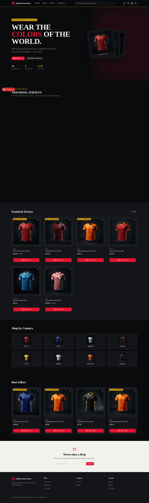
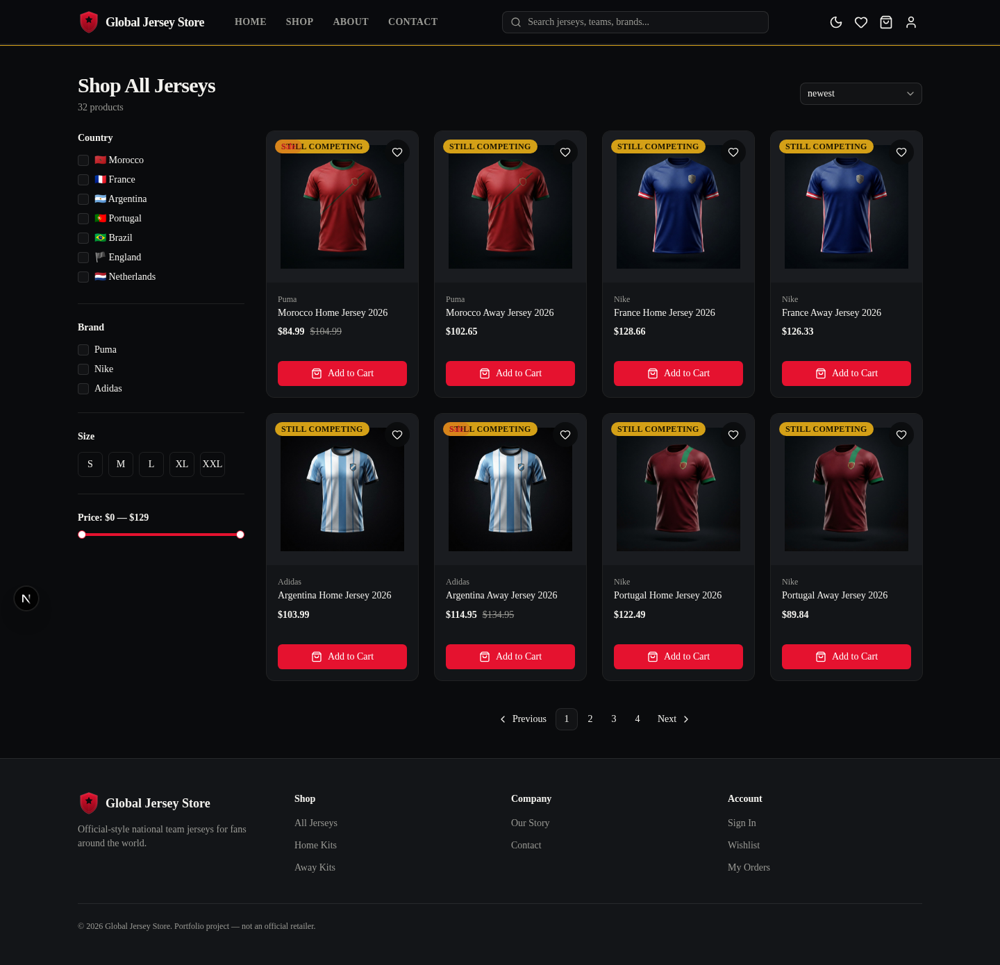
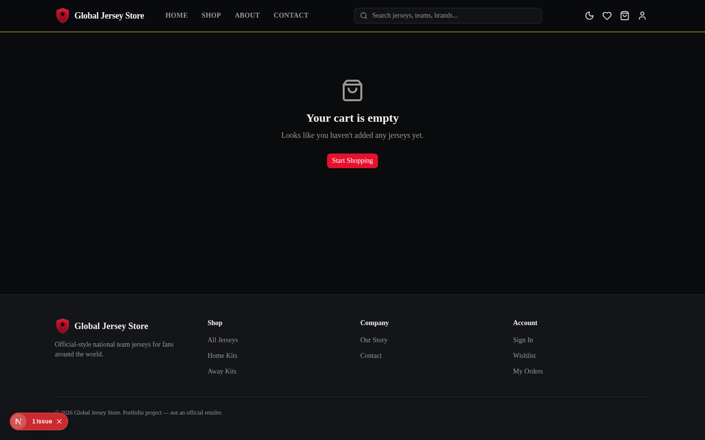
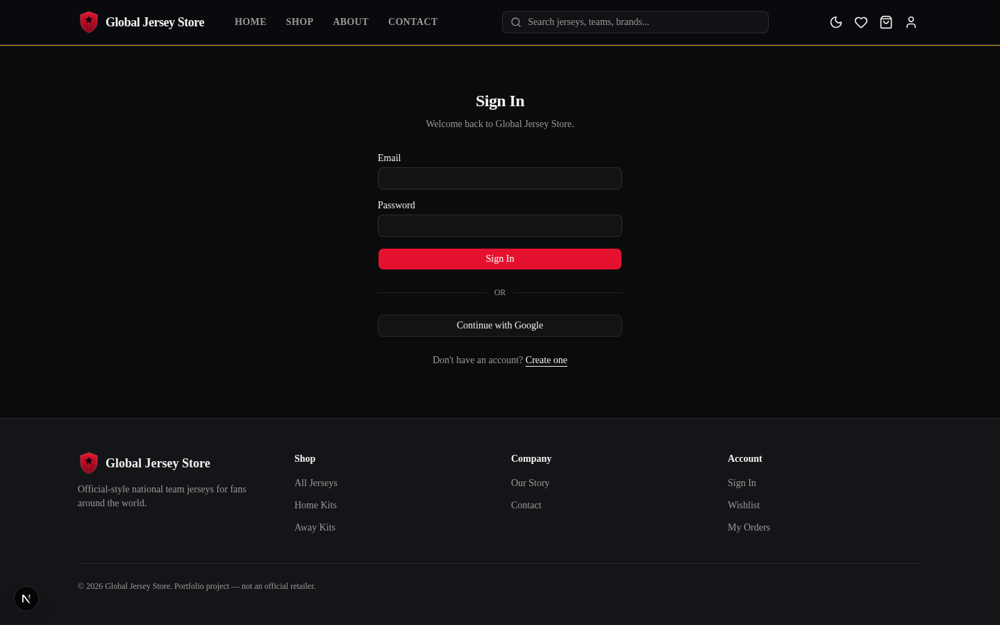

# Global Jersey Store

Une boutique e-commerce premium de maillots de football, avec un design sombre et haut de gamme inspiré de World Soccer Shop. Projet construit avec Next.js 15, TypeScript et Tailwind CSS.

## Aperçu

### Page d'accueil


### Boutique


### Panier


### Connexion


## Fonctionnalités

- Catalogue de 16 équipes nationales, maillots domicile/extérieur
- Fiche produit détaillée (tailles, personnalisation, galerie)
- Panier et liste de souhaits persistants (state management Zustand)
- Authentification (email/mot de passe) via Firebase
- Back-office admin pour gérer le catalogue
- Design 100% responsive, mobile-first
- Composants UI construits avec `@base-ui/react` + Tailwind (shadcn-style)

## Stack technique

- **Framework** : Next.js 15 (App Router)
- **Langage** : TypeScript
- **Style** : Tailwind CSS
- **UI Kit** : `@base-ui/react` (pattern `render` prop, pas Radix `asChild`)
- **State** : Zustand (panier, wishlist)
- **Auth / DB** : Firebase (Auth + Firestore)
- **Validation** : Zod
- **CI** : GitHub Actions (lint + build à chaque push)

## Lancer le projet en local

```bash
npm install
npm run dev
```

Ouvrir [http://localhost:3000](http://localhost:3000).

Pour activer Firebase en local, créer un fichier `.env.local` avec :

```
NEXT_PUBLIC_FIREBASE_API_KEY=...
NEXT_PUBLIC_FIREBASE_AUTH_DOMAIN=...
NEXT_PUBLIC_FIREBASE_PROJECT_ID=...
NEXT_PUBLIC_FIREBASE_STORAGE_BUCKET=...
NEXT_PUBLIC_FIREBASE_MESSAGING_SENDER_ID=...
NEXT_PUBLIC_FIREBASE_APP_ID=...
```

Sans ces variables, l'app tourne quand même avec des valeurs de démo (Auth/Firestore désactivés silencieusement).

## Documentation

Un rapport technique complet du projet est disponible dans [`docs/Global-Jersey-Store-Rapport.pdf`](docs/Global-Jersey-Store-Rapport.pdf).

## Structure du projet

```
app/            # Pages (App Router)
components/     # Composants UI réutilisables
features/       # Logique métier par domaine (cart, shop, admin, auth...)
lib/            # Utilitaires, store, config Firebase
constants/      # Données produits et équipes
```
