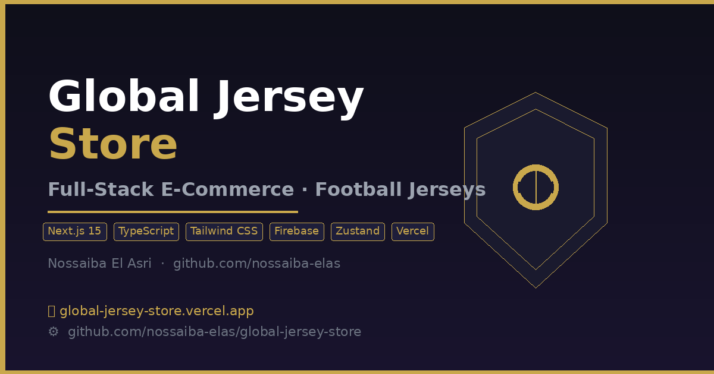
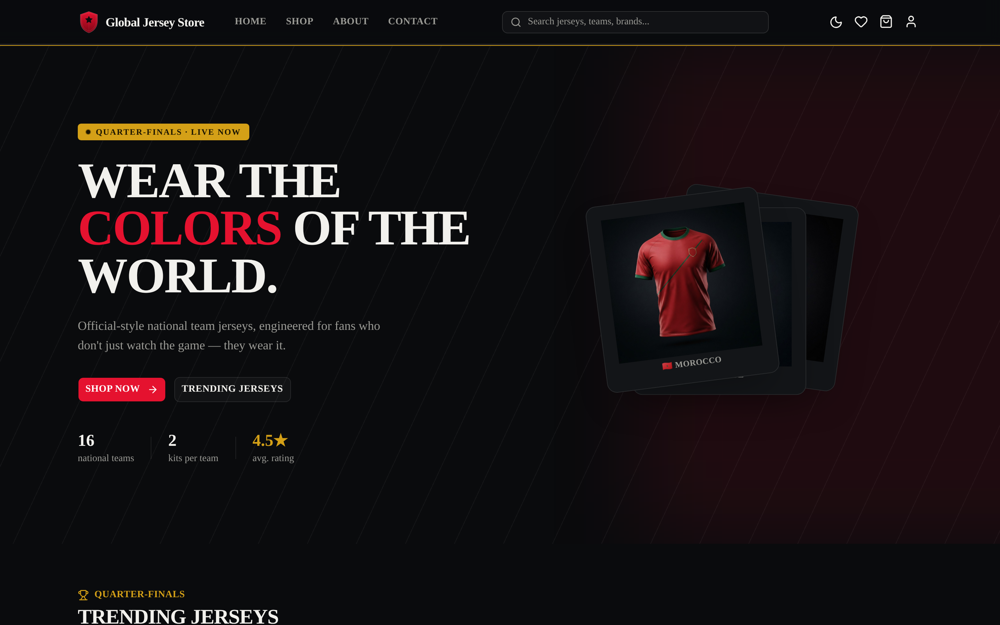
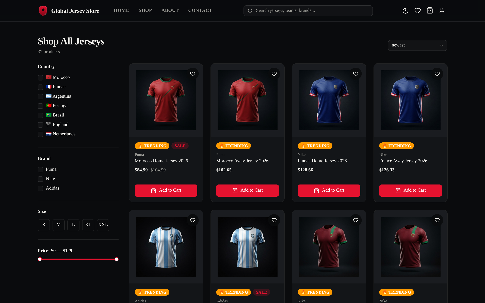
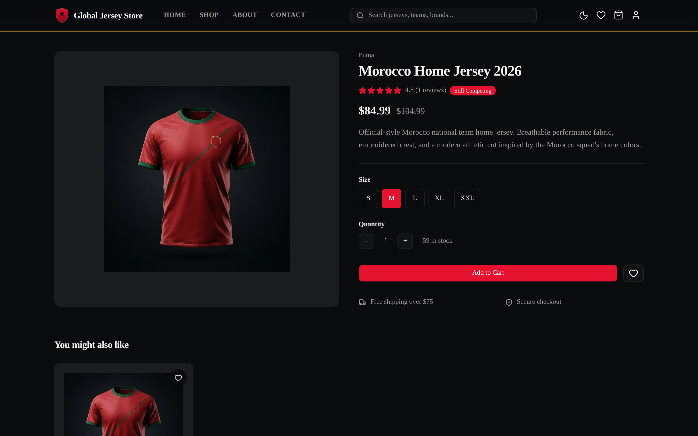

# ⚽ Global Jersey Store

> **Premium e-commerce web application for international football jerseys**
> Built as a professional portfolio project to demonstrate modern full-stack development.

[](https://global-jersey-store.vercel.app)
[](https://github.com/nossaiba-elas/global-jersey-store)
[](https://github.com/nossaiba-elas/global-jersey-store/actions/workflows/ci.yml)

---



---

## ✨ Features

- 🛍️ **Full Shopping Flow** — Browse → Cart → Checkout → Order Tracking
- 🔐 **Google Authentication** via Firebase OAuth
- 🎛️ **Admin Dashboard** — manage stock, orders, and analytics (restricted access)
- ❤️ **Wishlist** — save favourite jerseys across sessions
- 🌙 **Dark / Light Mode** toggle with persistence
- 🔍 **Instant Search** with advanced filters (country, brand, size, price)
- 📦 **Order Management** — unique references `GJS-2026-XXXXXX` with status tracking
- 📱 **Mobile-First** responsive design

---

## 🖼️ Screenshots

| Home | Shop |
|------|------|
|  |  |

| Product Detail | Login |
|----------------|-------|
|  |  |

---

## 🛠️ Tech Stack

| Layer | Technology |
|-------|------------|
| Framework | Next.js 15 (App Router) |
| Language | TypeScript (strict mode) |
| Styling | Tailwind CSS + shadcn/ui + @base-ui/react |
| State | Zustand (localStorage persistence) |
| Auth | Firebase Google OAuth |
| Deployment | Vercel (auto-deploy) |
| CI/CD | GitHub Actions |

---

## 🚀 Getting Started

```bash
git clone https://github.com/nossaiba-elas/global-jersey-store.git
cd global-jersey-store
npm install
npm run dev
```

Open [http://localhost:3000](http://localhost:3000)

---

## 📄 Technical Report

A detailed technical report is available in [`docs/Global-Jersey-Store-Report.pdf`](docs/Global-Jersey-Store-Report.pdf).

---

## 👩‍💻 Author

**Nossaiba El Asri**
[GitHub](https://github.com/nossaiba-elas) · [LinkedIn](https://linkedin.com/in/nossaiba-el-asri)

---

*Global Jersey Store — Portfolio project · July 2026*
